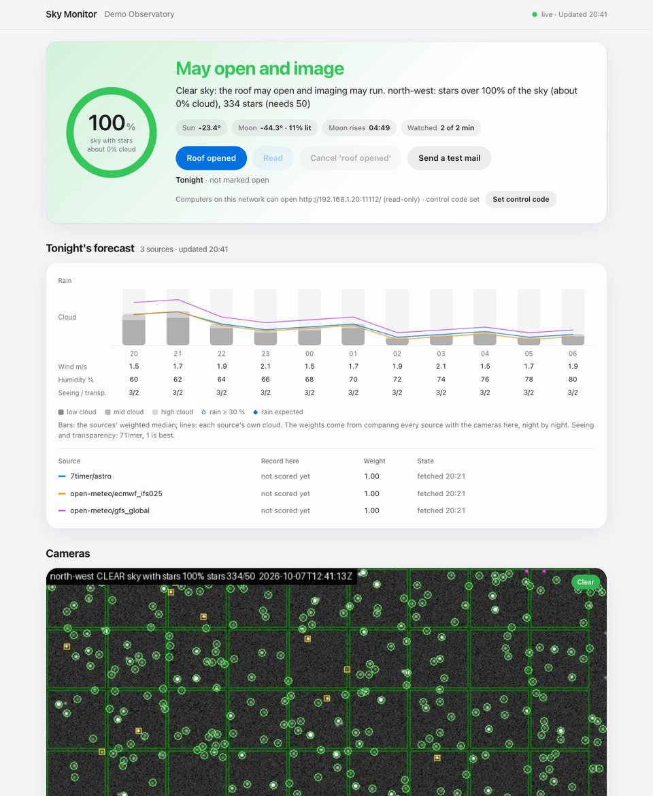

# Sky Monitor

Reads the sky cameras of a remote observatory and answers two questions, once a
minute by default: **may the roof be open**, and **may imaging run**. The answer
is shown on a control page, mailed to the operator, published as a
`status.json` file and served as two ASCOM Alpaca SafetyMonitor devices that
N.I.N.A., Voyager, SGP, ACP and similar software can read.

A night with it: the tray program starts with Windows and waits for the Sun to
set. From dusk it watches the cameras. When the sky has shown stars over most
of its cells for ten minutes it mails "the roof may open" with the camera
pictures attached, and repeats every half hour until the operator presses
*Read* or *Roof opened* on the page (or in the tray menu). *Roof opened* ends
the night's watching; it can be cancelled, and the next evening starts clean.

It needs only NumPy, SciPy, Pillow and an `ffmpeg` executable, and runs on
Windows, macOS and Linux (Python 3.11 or later). MIT licence. How it is built
and where it is going: [docs/architecture.md](docs/architecture.md); 中文说明见
[README.zh-CN.md](README.zh-CN.md).



> Alpha: **checked on one real camera over two nights only** (see [Validation](#validation)).
> A camera sees cloud, fog and a wet lens; it does not measure wind, humidity
> or the first drops of rain. Keep a hardware rain sensor on the roof
> controller: this tool decides when opening is worth it, the sensor protects
> the equipment.

## How it decides

The evidence is the one a person uses on a live view: **can stars be seen all
over the frame**.

1. **Stars.** One look is a short capture (16 frames over 8 s by default)
   stacked into two halves. A star is a compact source that is found in both
   halves, found again at the next look where the sky has carried it, and that
   does not stay at one place in the frame. Noise does not come back. A hot
   pixel, a lamp, a timestamp overlay does not move: a place that shows a
   source in half of the looks of the last 30 minutes is *fixed* and never
   counts (learned in the first 15 minutes, then kept on disk).
2. **Sky cells.** The sky region is divided into cells of about five stars.
   The *coverage* is the share of cells that hold stars; one minus it is the
   cloud amount the page shows. A camera reads
   - `CLEAR` when coverage is at least 70 % and it shows enough stars (50 by
     default, or half of its clear-night reference once calibrated),
   - `PARTLY` between 40 % and 70 %,
   - `CLOUDY` below that, or with too few stars,
   - `UNKNOWN` when it cannot tell: no frame, a frozen picture, a washed-out
     frame, the first look, the learning phase.
3. **The roof.** The worst camera decides. The roof may open once the sky has
   shown stars over 70 % of its cells *on average* for 10 minutes, with no look
   below 40 %: a few clouds drifting through do not start the wait again, a
   cloudy look does. `cloud_tolerance = "lenient"` (55 % / 30 %) or `"strict"`
   (85 % / 60 %) move both numbers. An open roof closes after two cloudy looks
   in a row, after 2 minutes without any sign of stars, after 30 minutes
   without a clear look, in daylight (Sun above -8 degrees), and when the
   monitor's own clock jumps (the computer slept). Imaging additionally needs a
   `CLEAR` look now and the Sun below -12 degrees.

4. **The Moon.** Moonlight hides faint stars the way thin cloud does, so a
   bright Moon high up lowers the star count a clear sky must show (by up to
   70 % at full Moon overhead, for both the default and the calibrated
   requirement), and cells far brighter than the rest of the sky — its halo —
   are set aside while it is up. `imaging_moon_max_illumination` keeps
   *imaging may run* off while a Moon lit beyond that fraction is above the
   horizon; the roof is never affected. The page shows the Moon's altitude,
   illumination and the next moonrise or moonset, and hours under a bright
   Moon do not count when the forecast sources are scored.

Everything that goes wrong reads as "not safe": a camera that cannot be
reached, a picture that stopped changing, a fault in the analysis, a monitor
that stopped (its answer carries a `validUntil` time, and the Alpaca devices
turn unsafe when it passes).

## Install

**Windows product.** `scripts/build-windows.ps1` builds
`SkyMonitor-Setup-<version>.exe` (Inno Setup; a zip when `ISCC.exe` is not
installed): `sky-monitor-tray.exe`, `sky-monitor.exe`, an LGPL ffmpeg, and an
optional *start with Windows* task. On the first start the tray writes
`%LOCALAPPDATA%\Sky Monitor\sky-monitor.toml`, opens the folder and asks for
the camera; from the second start it watches. Its menu opens the status page
(`http://127.0.0.1:11112/`), marks the roof opened and the reminder read.

**From source** (Windows, macOS, Linux; Python 3.11 or later):

```bash
python -m pip install ".[ffmpeg,tray]"
```

The `ffmpeg` extra brings an ffmpeg executable (through `imageio-ffmpeg`);
leave it out when `ffmpeg` is already on `PATH` (`ffmpeg = "C:/tools/ffmpeg.exe"`
in the settings names another one). The `tray` extra brings `pystray` for
`sky-monitor tray`; `sky-monitor autostart` puts the tray into the Windows
Startup folder.

## Use

```bash
sky-monitor init                 # writes sky-monitor.toml to fill in
sky-monitor doctor               # ffmpeg, Sun and Moon, one look through every camera
sky-monitor run                  # watch the sky until stopped (Ctrl+C); the page is on 127.0.0.1:11112
sky-monitor tray                 # the same behind a tray icon
sky-monitor status               # the running monitor's answer; exit 0 safe, 1 not safe, 2 no fresh answer
sky-monitor roof opened|cancel|read|status   # tonight's marks, for scripts
sky-monitor test-email           # one mail with the [email] settings
sky-monitor forecast [--refresh] # tonight's forecast and each source's record here
```

Every command takes `--config <file>` (default `sky-monitor.toml` in the
current directory; the tray uses the product's own location). The monitor
looks once a minute while it is dark and every five minutes while there is
nothing to watch (daylight, or the roof marked open), so an industrial PC
idles by day; one look costs about 0.15 s of analysis per 1080p camera on an
M3 Pro (two star detections of 63 ms), the rest is ffmpeg decoding the stream.

### The page and the night's marks

`http://127.0.0.1:11112/` shows the answer, the share of sky with stars as a
gauge, the camera pictures with their cells and stars marked, the night's
course, and four buttons: *Roof opened* (ends the night's watching and mail;
with `pause_when_opened = false` it only ends the mail), *Read* (ends the
half-hourly reminders for this clear spell), *Cancel 'roof opened'* and *Send
a test mail*. The marks live in `state/night.json` and reset the next
afternoon. While software is connected to the Alpaca devices, *Roof opened*
only ends the mail and the watching goes on: a paused monitor would read
unsafe, and N.I.N.A. would close the roof.

**Other computers.** By default only the observatory computer can open the
page. With `share = "lan"` under `[web]`, computers on the same network can
open it at `http://<the computer's address>:11112/` (the page on the
observatory computer shows the address) and see everything, read-only. The
buttons ask them for a control code, which is set on the observatory
computer's own page (*Set control code*) and stored in the settings; without
one the buttons work on the observatory computer only. Five wrong codes lock
that computer out for ten minutes. The safety devices stay for the
observatory computer, and the network does not see where the settings live.
The page is plain HTTP: the code is not encrypted on the network, so share it
on a network you trust, or reach the observatory through a private network
such as Tailscale.

### Tonight's forecast

With the site's `latitude` and `longitude` set, the page shows the hours of
darkness ahead above the cameras: cloud (split into low, mid and high cloud
where the models give it), rain probability and amount, wind, humidity, and
7Timer's seeing and transparency. The bars are the consensus of the sources, a
weighted median per hour and quantity; a thin line shows each source's own
cloud. `sky-monitor forecast` prints the same; `--refresh` asks the sources
first and says how long each took.

The sources are Open-Meteo (`open_meteo_models`: best match, ECMWF IFS, GFS,
ICON and CMA GRAPES by default), 7Timer's astronomy product and, with a key,
Caiyun (`caiyun_token`) and QWeather (`qweather_key`; `qweather_host` for
accounts with their own API host). Keys can be given as `${VARIABLE}` and never
reach a log, the status or the page. The sources are asked once an hour and
receive the site's coordinates rounded to `coordinate_precision` decimals (2,
about a kilometre), nothing else.

Which source is right at this site is measured, not assumed: every answer is
kept, and after each night every source's cloud forecast from about six hours
ahead is compared with the cloud the cameras measured, hour by hour. The page
lists each source's mean error, scored hours and share of clear/cloudy calls
that were right over the last 30 nights; from 24 scored hours on, that error
sets the source's weight.

A forecast never opens or closes the roof by itself. Its one effect on the
answer is the rain veto: with `rain_veto_hours` set, a closed roof stays closed
while rain is forecast within that many hours (probability at least
`rain_veto_probability`, or `rain_veto_mm` in an hour); the wait keeps counting,
so the roof may open as soon as the rain leaves the forecast. The page shows a
chip while it applies.

### Mail

`[email]` names the SMTP server (QQ, 163 and corporate mail: SSL on port 465
with the SMTP authorisation code as the password), the sender and the
recipients. The first mail of a clear spell carries the camera pictures; it
repeats every `repeat_minutes` (30) until *Read* or *Roof opened*, and a short
mail follows when the sky stops being good enough. Passwords can be given as
`${VARIABLE}`.

### Cameras

| `type` | Reads | Typical use |
|---|---|---|
| `stream` | anything ffmpeg opens: `rtsp://`, `http://` (MJPEG, HLS, FLV), a video file | surveillance cameras |
| `snapshot` | an HTTP(S) address that returns the current picture | an all-sky camera's `image.jpg` |
| `file` | a picture another program keeps up to date, or the newest picture of a folder | all-sky software on the same computer |

A camera that only shows in a vendor's application or web page can be read from
the screen on Windows: `type = "stream"`, `url = "desktop"` and
`input_options = ["-f", "gdigrab", "-offset_x", ..., "-video_size", ...]` (the
settings template has the full line). Passwords can stay out of the file:
`${NAME}` in an address is replaced by that environment variable, and no log,
status or error text carries a password.

Tell each camera where the sky is, as fractions of the frame: `rectangle`,
`circle` (an all-sky lens), `exclude` boxes (timestamps, logos, roof edges) or
a `mask` image. Stars cross the frame faster in a narrower lens; raise
`drift_px_per_minute` when a clear sky shows many detections but few stars.

Stars are faint detail, the first thing a starved video stream throws away:
read the camera's main stream at a generous bitrate rather than a low-bitrate
sub-stream. Heavy compression makes a clear sky read as cloudy, not the other
way round.

### What it writes

All in the `output.directory` (default `sky-monitor-data` beside the settings
file), and nowhere else:

- `status.json`: `safe`, `imagingOk`, `reason`, a one-sentence `message`
  (Chinese or English), `updatedAt`, `validUntil`, the Sun and Moon, and per
  camera `verdict`, `reason`, `coverage`, `starCount`, `requiredStars`,
  `fixedSources`. A reader must treat a status past `validUntil` as not safe;
  `sky-monitor status` does.
- `preview/<camera>.jpg`: the latest frame with its sky cells (green: stars,
  red: none, grey: blinded), counted stars (green circles), fixed sources
  (yellow squares) and unconfirmed sources (purple). Look at it before trusting
  a new camera.
- `history/<date>.jsonl`: every status (without the forecast), for tuning
  thresholds afterwards.
- `forecast/latest.json` (what the page shows), `forecast/snapshots/<date>.jsonl`
  (every answer of every source, about 3 MB a day with the default sources)
  and `forecast/skill.jsonl` (the nightly scores); kept for 60 days.
- `state/`: the fixed sources of each camera; `reference.json`: calibrated
  clear-sky star counts; `sky-monitor.log`.
- `archive/<camera>/<time>-<VERDICT>.png`, only with `archive_minutes` set:
  the stacked frame behind a verdict, every so many minutes and whenever the
  verdict changes (16-bit, removed after `archive_days`). These are what
  thresholds are tuned on; `sky-monitor analyze` reads them.

### N.I.N.A. and other ASCOM software

The monitor serves two Alpaca SafetyMonitor devices on `127.0.0.1:11112`:
device 0 "roof may open" and device 1 "imaging may run". In N.I.N.A. choose one
under *Equipment > Safety Monitor* (Alpaca discovery finds it; otherwise create
an ASCOM Alpaca dynamic driver for that address and port) and use the *Wait
until safe* / *Loop while safe* instructions. Set `host = "0.0.0.0"` under
`[alpaca]` to serve the devices to other computers too (only then do they
answer discovery from the network). A device reports unsafe until a client
has connected to it.

### Other notifications

`[notify] command = [...]` runs a program when the answer changes;
`{state}` (`CLOSED`, `OPEN`, `IMAGING`), `{message}` and `{message_url}` are
replaced, and `SKY_MONITOR_STATE` / `SKY_MONITOR_MESSAGE` are set in its
environment.

### Calibrating a camera

Out of the box a clear sky must show 50 stars. A camera that shows fewer never
opens the roof; one that shows thousands should be held to more. On a clear,
moonless night with the monitor running:

```bash
sky-monitor calibrate            # keeps the median star count of the last 30 minutes
```

From then on that camera needs half of that count (less under a bright Moon,
when the site's coordinates are set). The command refuses a record in which
the count was not steady.

### Trying a picture or a recording

```bash
sky-monitor analyze clear-night.mp4 --out marked.jpg
```

prints what one or two looks measure (stars, coverage) and writes the marked-up
frame. Use it on recordings of clear and cloudy nights to choose thresholds.

## Validation

What has been checked, and how:

- The Sun and Moon positions agree with Astropy within 0.011 degrees on eight
  dates and sites (`tests/test_skymonitor_ephemeris.py` holds the reference
  values).
- The analysis, decision, sources, forecast, Alpaca interface and commands are
  covered by 171 tests, the cameras on synthetic skies
  (`skymonitor/synthetic.py`): a clear sky, an
  overcast one with more hot pixels than a clear sky needs stars, cloud banks,
  frozen pictures, failing cameras, daylight, clock jumps, a monitor stopped in
  the middle of a look. Two tests go through a real video codec with ffmpeg:
  stars survive it, and its artifacts on a textured overcast are not counted
  as stars.
- The forecast adapters are tested against answers recorded once from
  Open-Meteo and 7Timer (for a public place near Lijiang) and against answers
  written from Caiyun's and QWeather's documentation, including their failures
  (HTTP errors, timeouts, broken answers; no key or token in any message).
- One real installation since October 2026: a Windows 11 observatory PC
  running the tray from source (Python 3.12) as a log-on task, reading a
  2560x1440 HEVC surveillance camera at 2.7 Mb/s that faces north-west. On its
  first, overcast night every look after the learning phase read cloudy (0–1
  stars, 0–11 % of the sky), which matched the pictures; the status page, the
  Alpaca devices, the forecast sources (Open-Meteo 3.3 s, 7Timer 3.8 s from
  there) and a restart that keeps the learned fixed sources all worked. On its
  second night, partly cloudy with clouds over the western third, the camera
  showed 16 stars at dusk rising to 131 as twilight deepened; the roof was
  allowed at 19:41 local time (Sun at −11.6°, stars over 71 % of the sky on
  average over the ten-minute wait, 101 stars in that look) and imaging two
  minutes later, and the operator judged the opening reasonable.

What has **not** been checked:

- More nights and more cameras: the thresholds have seen one overcast and one
  partly cloudy night on one camera. Fully dark clear skies, fog, thin high
  cloud, a bright Moon and other cameras are still to be recorded; until then
  treat the answer as advice and watch the previews.
- The test suite on Windows (it runs on macOS), the Windows build script, the
  installer and `sky-monitor autostart`; the PyInstaller spec was built and
  run on macOS only.
- Real mail servers: the SMTP code is tested against a fake server only.
- ASCOM's ConformU conformance tool and a session with N.I.N.A.
- Screen capture (`gdigrab`).
- Twilight flats or a daytime cloud estimate: in daylight the answer is simply
  "not safe".
- Caiyun and QWeather against their live services (no keys were at hand), and
  the forecast scores: they need nights with the cameras running before any
  source earns a weight.
