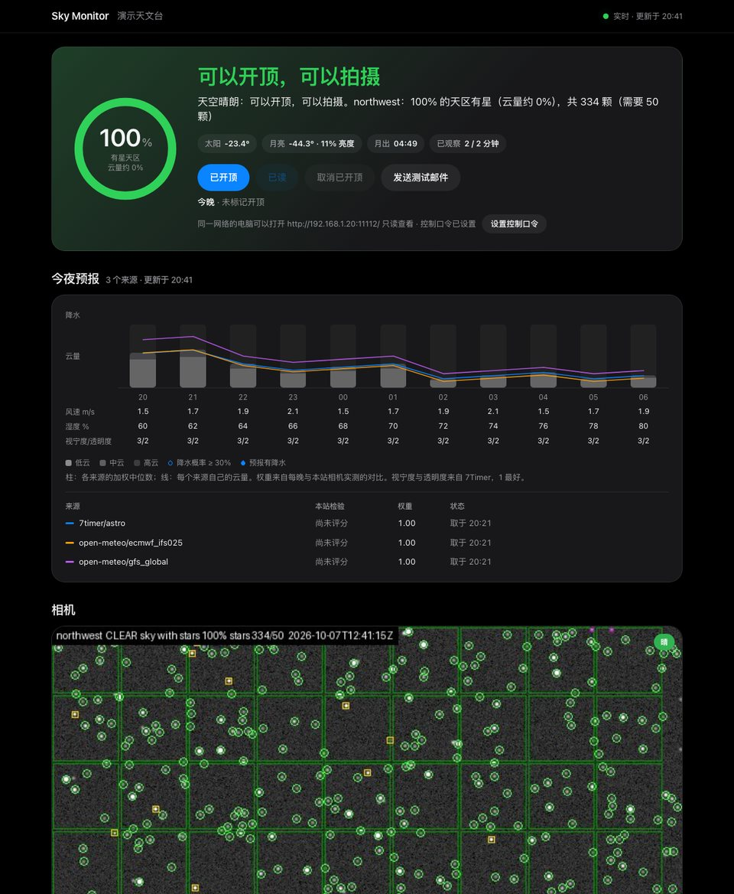

# Sky Monitor

English: [README.md](README.md)

读取远程天文台的天空相机，回答两个问题，默认每分钟一次：**能不能开顶**，**能不能拍摄**。结果显示在控制页上，用邮件发给操作员，写入 `status.json` 文件，并作为两个 ASCOM Alpaca SafetyMonitor 设备对外提供，N.I.N.A.、Voyager、SGP、ACP 等软件都能读取。

用它过一晚是这样的：托盘程序随 Windows 启动，等太阳落山。从黄昏起，它开始盯着相机。当天空的大部分格子在十分钟里都看得到星，它就发出“可以开顶”的邮件并附上相机画面，之后每半小时重发一次，直到操作员在页面上（或托盘菜单里）点 *已读* 或 *已开顶*。*已开顶* 结束当晚的监测；它可以取消，第二天傍晚一切从头开始。

只依赖 NumPy、SciPy、Pillow 和一个 `ffmpeg` 可执行文件，可在 Windows、macOS 和 Linux 上运行（Python 3.11 或更高版本）。MIT 许可证。架构与发展方向见 [docs/architecture.md](docs/architecture.md)；英文说明见 [README.md](README.md)。



> Alpha 阶段：**只在一台真实相机上检验过两个夜晚**（见[验证](#验证)）。相机看得到云、雾和沾水的镜头，但测不了风和湿度，也测不到刚落下的雨点。请在屋顶控制器上保留硬件雨水传感器：本工具判断什么时候值得开顶，传感器负责保护设备。

## 怎样判断

依据和人看实时画面时用的一样：**整个画面里都能看到星吗**。

1. **星点。** 一次查看就是一段短采集（默认 8 秒内 16 帧），分成前后两半各自叠加。星点是这样的点状光源：前后两半里都能找到；下一次查看时，在天空转动把它带到的位置上再次找到；而且不会一直停在画面的同一处。噪声不会重复出现。热像素、灯、画面上叠加的时间戳都不会移动：最近 30 分钟里有一半的查看都在同一处出现光源，这个位置就是*固定亮点*，永远不计数（前 15 分钟学习，之后保存在磁盘上）。
2. **天区格子。** 天空区域被分成若干格子，每格大约五颗星。*覆盖率*是有星格子所占的比例；1 减去它就是页面上显示的云量。一台相机的判定为：
   - `CLEAR`：覆盖率至少 70%，且看到的星足够多（默认 50 颗，校准后为它晴夜参考星数的一半）；
   - `PARTLY`：覆盖率在 40% 到 70% 之间；
   - `CLOUDY`：低于 40%，或星太少；
   - `UNKNOWN`：无法判断——没有画面、画面卡住、画面过亮、第一次查看、学习阶段。
3. **开关顶。** 以最差的那台相机为准。天空在 10 分钟里*平均* 70% 的格子有星，且期间没有一次查看低于 40%，就可以开顶：飘过几朵云不会让等待从头开始，一次多云的查看则会。`cloud_tolerance = "lenient"`（55% / 30%）或 `"strict"`（85% / 60%）会同时改变这两个数。已经打开的顶在以下情况关闭：连续两次查看多云；2 分钟内没有任何星的迹象；30 分钟内没有一次晴的查看；天亮（太阳高度高于 -8°）；监测程序自己的时钟跳变（电脑休眠过）。拍摄还另外要求当前这次查看为 `CLEAR`，且太阳高度低于 -12°。

4. **月亮。** 月光会像薄云一样掩盖暗星，所以明亮的月亮高挂时，晴空必须显示的星数会降低（满月在天顶时最多降低 70%，默认要求和校准后的要求都如此）；月亮在地平线以上时，比其余天空亮得多的格子——也就是月亮周围的光晕——会被排除。`imaging_moon_max_illumination` 让*可以拍摄*在照亮比例超过该值的月亮位于地平线以上时保持关闭；开顶从不受影响。页面显示月亮的高度、照亮比例和下一次月出或月落时间；给预报来源评分时，明亮月光下的小时不计入。

出任何问题都按“不安全”处理：相机连不上、画面不再变化、分析出错、监测程序停止（它的结果带有 `validUntil` 时间，过了这个时间 Alpaca 设备就变为不安全）。

## 安装

**Windows 安装版。** `scripts/build-windows.ps1` 生成 `SkyMonitor-Setup-<version>.exe`（Inno Setup；没有安装 `ISCC.exe` 时生成 zip）：包含 `sky-monitor-tray.exe`、`sky-monitor.exe`、一个 LGPL 版本的 ffmpeg，以及可选的*开机时自动启动*任务。首次启动时，托盘程序写出 `%LOCALAPPDATA%\Sky Monitor\sky-monitor.toml`，打开所在文件夹并提示填写相机；从第二次启动起开始监测。托盘菜单可以打开状态页（`http://127.0.0.1:11112/`）、标记已开顶、标记提醒已读。

**从源码安装**（Windows、macOS、Linux；Python 3.11 或更高版本）：

```bash
python -m pip install ".[ffmpeg,tray]"
```

可选依赖 `ffmpeg` 会（通过 `imageio-ffmpeg`）带来一个 ffmpeg 可执行文件；`PATH` 上已有 `ffmpeg` 时可以不装（在设置里写 `ffmpeg = "C:/tools/ffmpeg.exe"` 可以指定另一个）。可选依赖 `tray` 带来 `sky-monitor tray` 所需的 `pystray`；`sky-monitor autostart` 把托盘程序放进 Windows 的“启动”文件夹。

## 使用

```bash
sky-monitor init                 # 写出待填写的 sky-monitor.toml
sky-monitor doctor               # 检查 ffmpeg、太阳和月亮，每台相机各看一次
sky-monitor run                  # 一直看天，直到停止（Ctrl+C）；页面在 127.0.0.1:11112
sky-monitor tray                 # 同上，以托盘图标运行
sky-monitor status               # 运行中的监测程序给出的结果；退出码 0 安全，1 不安全，2 没有未过期的结果
sky-monitor roof opened|cancel|read|status   # 今晚的标记，供脚本使用
sky-monitor test-email           # 按 [email] 设置发一封邮件
sky-monitor forecast [--refresh] # 今晚的预报，以及各来源在本站的历史成绩
```

所有命令都接受 `--config <file>`（默认是当前目录下的 `sky-monitor.toml`；托盘程序用产品自己的设置位置）。监测程序在天黑时每分钟查看一次，无事可看时（白天，或已标记开顶）每五分钟一次，所以工控机白天基本空闲；在 M3 Pro 上，每台 1080p 相机每次查看约需 0.15 秒分析（两次星点检测，各 63 毫秒），其余时间是 ffmpeg 在解码视频流。

### 页面与当晚标记

`http://127.0.0.1:11112/` 显示结果、表示有星天区比例的仪表、标出格子和星点的相机画面、当晚的走势，以及四个按钮：*已开顶*（结束当晚的监测和邮件；设置 `pause_when_opened = false` 时只停止邮件）、*已读*（停止这段晴空的半小时提醒）、*取消已开顶* 和 *发送测试邮件*。这些标记保存在 `state/night.json` 中，第二天下午重置。当有软件连接着 Alpaca 设备时，*已开顶* 只会停止发邮件，监测继续进行：暂停的监测会读作不安全，N.I.N.A. 会因此关顶。

**其他电脑。** 默认只有工控机自己能打开这个页面。在 `[web]` 里设置 `share = "lan"` 后，同一网络的电脑可以用 `http://<工控机的地址>:11112/` 打开（工控机自己的页面上会显示这个地址），能看到全部内容，但只能看。它们按按钮时需要输入控制口令；口令在工控机自己的页面上设置（*设置控制口令*），保存在设置文件里；不设口令时，按钮只能在工控机上使用。同一台电脑连续输错 5 次，会被锁定 10 分钟。安全设备仍只为工控机服务，网络上的电脑也看不到设置文件的位置。页面走的是普通 HTTP，口令在网络上不加密，所以请只在信得过的网络里共享，或通过 Tailscale 这类私有网络访问天文台。

### 今夜预报

设置了站点的 `latitude` 和 `longitude` 后，页面会在相机画面上方显示接下来的天黑时段：云量（模式提供时细分为低云、中云、高云）、降水概率和降水量、风、湿度，以及 7Timer 的视宁度和透明度。柱子是各来源的共识，即每个小时、每个量的加权中位数；细线是每个来源自己的云量。`sky-monitor forecast` 打印同样的内容；`--refresh` 会先向各来源请求，并报告每个来源各用了多长时间。

来源有 Open-Meteo（`open_meteo_models`：默认为 best match、ECMWF IFS、GFS、ICON 和 CMA GRAPES）、7Timer 的天文预报产品，以及有密钥时的彩云天气 Caiyun（`caiyun_token`）和和风天气 QWeather（`qweather_key`；有自己 API Host 的账户用 `qweather_host`）。密钥可以写成 `${VARIABLE}`，永远不会进入日志、状态或页面。每小时向各来源请求一次，它们只收到四舍五入到 `coordinate_precision` 位小数的站点坐标（2 位，约一公里），别的什么都收不到。

哪个来源在本站准，是实测出来的，不是假设的：每次回答都会保存；每晚结束后，把每个来源提前约六小时给出的云量预报与相机实测的云量逐小时比较。页面列出每个来源最近 30 晚的平均误差、已评分小时数和晴/云判断的命中率；已评分小时数达到 24 后，这个误差决定该来源的权重。

预报从不单独开顶或关顶。它对结果唯一的影响是降雨否决：设置了 `rain_veto_hours` 后，只要预报在这么多小时内有雨（概率至少为 `rain_veto_probability`，或一小时降水量达到 `rain_veto_mm`），关着的顶就保持关闭；等待照常计时，所以雨一从预报里消失就可以开顶。否决生效期间，页面上会显示一个小标签。

### 邮件

`[email]` 指定 SMTP 服务器（QQ 邮箱、163 邮箱和企业邮箱：465 端口走 SSL，密码填 SMTP 授权码）、发件人和收件人。一段晴空的第一封邮件附带相机画面；之后每隔 `repeat_minutes`（30）分钟重发一次，直到点了 *已读* 或 *已开顶*；天空不再够好时，会再发一封简短的邮件。密码可以写成 `${VARIABLE}`。

### 相机

| `type` | 读取 | 典型用途 |
|---|---|---|
| `stream` | ffmpeg 能打开的任何东西：`rtsp://`、`http://`（MJPEG、HLS、FLV）、视频文件 | 监控摄像头 |
| `snapshot` | 返回当前画面的 HTTP(S) 地址 | 全天相机的 `image.jpg` |
| `file` | 由其他程序持续更新的图片，或某个文件夹里最新的图片 | 同一台电脑上的全天相机软件 |

只能在厂商的应用或网页里看到画面的相机，在 Windows 上可以从屏幕读取：`type = "stream"`、`url = "desktop"` 和 `input_options = ["-f", "gdigrab", "-offset_x", ..., "-video_size", ...]`（设置模板里有完整的一行）。密码可以不写进文件：地址里的 `${NAME}` 会替换成该环境变量的值，任何日志、状态或错误信息都不会带出密码。

为每台相机指定画面中哪里是天空，用画面尺寸的比例表示：`rectangle`、`circle`（全天镜头）、`exclude` 排除框（时间戳、logo、屋顶边缘）或一张 `mask` 图片。镜头视场越窄，星点穿过画面越快；如果晴空下检测到很多光源，却只认出很少的星，请调大 `drift_px_per_minute`。

星点是暗弱的细节，码率不足的视频流最先丢掉的就是它们：请读取相机的主码流并给足码率，不要用低码率的子码流。重度压缩会让晴空被判成多云，而不会反过来。

### 输出文件

全部写在 `output.directory` 中（默认是设置文件旁边的 `sky-monitor-data`），不会写到别的地方：

- `status.json`：`safe`、`imagingOk`、`reason`、一句话的 `message`（中文或英文）、`updatedAt`、`validUntil`、太阳和月亮，以及每台相机的 `verdict`、`reason`、`coverage`、`starCount`、`requiredStars`、`fixedSources`。读取方必须把超过 `validUntil` 的状态当作不安全；`sky-monitor status` 就是这样做的。
- `preview/<camera>.jpg`：最新一帧，标出天区格子（绿：有星，红：无星，灰：被亮光淹没）、计入的星（绿圈）、固定亮点（黄方框）和未确认的光源（紫色）。信任一台新相机之前，先看看它。
- `history/<date>.jsonl`：每一次的状态（不含预报），供事后调整阈值。
- `forecast/latest.json`（页面显示的内容）、`forecast/snapshots/<date>.jsonl`（每个来源的每次回答，默认来源下每天约 3 MB）和 `forecast/skill.jsonl`（每晚的评分）；保留 60 天。
- `state/`：每台相机的固定亮点；`reference.json`：校准得到的晴空星数；`sky-monitor.log`。
- `archive/<camera>/<time>-<VERDICT>.png`，仅在设置了 `archive_minutes` 时生成：判定所依据的叠加帧，每隔这么多分钟保存一张，判定变化时也保存（16 位，`archive_days` 天后删除）。阈值就是在这些图上调出来的；`sky-monitor analyze` 可以读取它们。

### N.I.N.A. 和其他 ASCOM 软件

监测程序在 `127.0.0.1:11112` 上提供两个 Alpaca SafetyMonitor 设备：设备 0 是“可以开顶”，设备 1 是“可以拍摄”。在 N.I.N.A. 的 *Equipment > Safety Monitor* 下选择其中一个（Alpaca 自动发现能找到它；找不到时，为该地址和端口新建一个 ASCOM Alpaca 动态驱动），然后使用 *Wait until safe* / *Loop while safe* 指令。在 `[alpaca]` 里设置 `host = "0.0.0.0"`，设备也会为其他电脑服务（只有这时它们才会回应来自网络的自动发现）。在有客户端连接之前，设备一直报告不安全。

### 其他通知方式

`[notify] command = [...]` 在结果变化时运行一个程序；其中的 `{state}`（`CLOSED`、`OPEN`、`IMAGING`）、`{message}` 和 `{message_url}` 会被替换，并在它的环境变量中设置 `SKY_MONITOR_STATE` / `SKY_MONITOR_MESSAGE`。

### 校准相机

默认情况下，晴空必须显示 50 颗星。看到的星比这少的相机永远不会让顶打开；能看到几千颗星的相机则应该要求得更多。在晴朗无月的夜晚，监测程序运行时执行：

```bash
sky-monitor calibrate            # 保存最近 30 分钟星数的中位数
```

此后这台相机需要达到这个数的一半（设置了站点坐标时，明亮月光下要求更低）。星数不稳定的记录会被这条命令拒绝。

### 用图片或录像试验

```bash
sky-monitor analyze clear-night.mp4 --out marked.jpg
```

这条命令打印一两次查看测得的结果（星数、覆盖率），并写出标注后的画面。拿晴夜和多云夜晚的录像来试，以选定阈值。

## 验证

已检查的内容及方法：

- 太阳和月亮的位置在八组日期和地点上与 Astropy 相差不超过 0.011°（参考值在 `tests/test_skymonitor_ephemeris.py` 中）。
- 分析、决策、取帧、预报、Alpaca 接口和命令由 171 个测试覆盖，相机部分用合成天空（`skymonitor/synthetic.py`）测试：晴空、热像素比晴空所需星数还多的阴天、云带、冻结的画面、出故障的相机、白天、时钟跳变、在一次查看中途停止的监测程序。有两个测试用 ffmpeg 经过真实的视频编解码器：星点能保留下来，而它在有纹理的阴天画面上产生的压缩伪影不会被算作星。
- 预报适配器的测试数据，是从 Open-Meteo 和 7Timer 一次性录下的回答（丽江附近的一个公开地点），以及按彩云天气 Caiyun 和和风天气 QWeather 的文档写出的回答，包括它们的出错情况（HTTP 错误、超时、损坏的回答；任何消息里都没有密钥或令牌）。
- 自 2026 年 10 月起有一处真实安装：一台 Windows 11 天文台电脑，以登录时启动的任务从源码运行托盘程序（Python 3.12），读取一台朝向西北、码率 2.7 Mb/s 的 2560x1440 HEVC 监控摄像头。它的第一晚是阴天，学习阶段之后的每次查看都判为多云（0–1 颗星，有星天区 0–11%），与画面相符；状态页、Alpaca 设备、预报来源（从那里请求 Open-Meteo 用时 3.3 秒，7Timer 3.8 秒）以及保留已学到的固定亮点的重启，都工作正常。第二晚部分有云，西边约三分之一有云：天刚黑时相机能看到 16 颗星，随暮光变暗增加到 131 颗；当地时间 19:41 允许开顶（太阳 −11.6°，十分钟等待期内平均 71% 的天区有星，这一次看到 101 颗星），两分钟后允许拍摄，操作员认为这次开顶判断合理。

**尚未**检查的内容：

- 更多夜晚和更多相机：阈值目前只经历过一台相机上的一个阴天夜和一个部分有云的夜晚。全黑的晴夜、雾、薄的高云、明亮的月亮以及其他相机都还有待记录；在此之前，请把结果当作建议，并留意预览图。
- Windows 上的测试套件（它在 macOS 上运行）、Windows 构建脚本、安装程序和 `sky-monitor autostart`；PyInstaller spec 只在 macOS 上构建并运行过。
- 真实的邮件服务器：SMTP 代码只针对模拟服务器测试过。
- ASCOM 的 ConformU 一致性检测工具，以及一次 N.I.N.A. 实际拍摄。
- 屏幕捕获（`gdigrab`）。
- 晨昏平场或白天的云量估计：白天的结果一律是“不安全”。
- 彩云天气 Caiyun 和和风天气 QWeather 的线上服务（手头没有密钥），以及预报评分：要等相机运行若干个夜晚之后，才会有来源获得权重。
